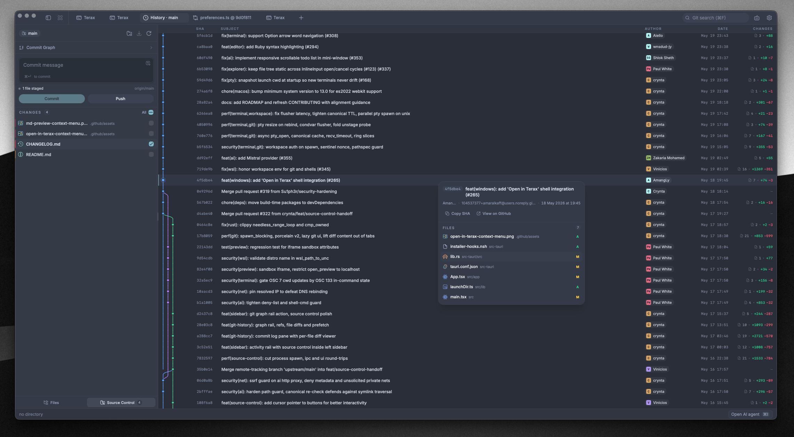

<div align="center">
  
  <h1>OpinCode</h1>

  <p><strong>Lightweight Terminal-first AI-native dev workspace.</strong></p>

  <p>
    
    
    
  </p>
</div>

---

OpinCode is a lightweight open-source terminal (ADE) built on Tauri 2 + Rust and React 19. A native PTY backend with a WebGL renderer, an agentic AI side-panel that runs against your own keys or fully local models, plus a code editor, file explorer, source control with a git graph, and a web preview pane built in. About 7-8 MB on disk. No telemetry. No account.

## Screenshots

<table>
  <tr>
    <td align="center"><br/><sub>Multi-tab terminal with WebGL rendering</sub></td>
    <td align="center"><br/><sub>Custom themes, presets, and background images</sub></td>
  </tr>
  <tr>
    <td align="center"><br/><sub>Web preview of local dev servers</sub></td>
    <td align="center"><br/><sub>Source control panel with git graph in history</sub></td>
  </tr>
  <tr>
    <td colspan="2" align="center"><br/><sub>Agentic AI workflow with edit diffs in the code editor</sub></td>
  </tr>
</table>

## Features

### Terminal

- xterm.js with WebGL renderer, multi-tab with background streaming
- Native PTY backend via `portable-pty` (zsh, bash, pwsh, fish, cmd)
- Split panels (horizontal and vertical)
- Inline search, link detection, true-color
- Per-tab workspace environments on Windows (Local, or any installed WSL distro)

### Code editor

- CodeMirror 6 (supports all popular languages - TS/JS, Rust, Python, Go, C/C++, Java, HTML/CSS, JSON, Markdown, etc.)
- Inline AI autocomplete with local model support
- AI edit diffs, accept or reject hunk by hunk
- Vim mode
- Ten built-in editor themes: Atom One, Aura, Copilot, GitHub Dark / Light, Gruvbox Dark, Nord, Tokyo Night, Xcode Dark / Light

### Source control

- Stage / unstage hunks, commit (Cmd+Enter / Ctrl+Enter), push with upstream awareness
- Branch display including detached HEAD state
- Git history pane with a real commit graph (lane rendering for merges and branches)
- Commit search and filter, click through to the remote commit page

### File explorer

- Catppuccin icon theme
- Fuzzy search, keyboard navigation, inline rename, context actions
- Attach files and selections directly to the AI side-panel

### Web preview

- Auto-detects local dev servers and opens them in a preview tab
- External URL preview via a native child webview

### Themes and customization

- Custom themes built in-app, switch between bundled presets and your own
- Create your own themes, share them or import from the community
- Background images with adjustable opacity and blur
- Editor theme is independent from the app theme

### AI

- **BYOK providers:** OpenAI, Anthropic, Google (Gemini), Groq, xAI (Grok), Cerebras, OpenRouter, DeepSeek, Mistral, plus any OpenAI-compatible endpoint
- **Local / offline:** LM Studio, MLX, Ollama
- **Agentic workflow:** plans, sub-agents, project memory via `OPINCODE.md`, file read / write / edit / multi-edit / grep / glob, bash with approval gating, background processes
- **Composer:** snippets via `#handle`, files via `@path`, slash commands, voice input, attach-to-agent from explorer or selection
- **Custom agents** with their own system prompt and tool subset
- **Plan mode** for multi-step work, generates and confirms before doing

## Install

Latest installers are on the [Releases](https://github.com/squareexp/opincode-ai/releases/latest) page. OpinCode auto-updates from there.

Version bumps on `main` automatically create the matching `vX.Y.Z` tag and publish a release.

### Windows notes

- On first launch Windows shows "Windows protected your PC" because OpinCode isn't code-signed yet (will be fixed soon). Click **More info** then **Run anyway**.
- Default shell detection: `pwsh.exe` (PowerShell 7+) -> `powershell.exe` (Windows PowerShell 5.1), -> `cmd.exe`.
- WSL is a first-class workspace environment, not a wrapped subprocess.

### Linux notes

- **Arch / AUR:** `yay -S opincode-bin` (or `paru`, etc.). Tracks the latest release.
- **AppImage:** needs FUSE. Without it: `./OpinCode_*.AppImage --appimage-extract-and-run`. On Wayland with rendering glitches, try `WEBKIT_DISABLE_DMABUF_RENDERER=1`. Otherwise the `.deb` / `.rpm` packages link against the system GTK stack and tend to be smoother.

## Configure AI

1. Open **Settings -> AI**.
2. Pick a provider and paste your API key. For local inference, point OpinCode at your LM Studio / MLX / Ollama endpoint.
3. Keys are written to the OS keychain via `keyring`. They never touch disk or localStorage.

## Build from source

**Prerequisites**
- Rust (stable), https://rustup.rs
- Bun (stable), https://bun.sh
- Tauri prerequisites for your platform, https://tauri.app/start/prerequisites/

**Run**
```bash
bun install
bun tauri dev          # development
bun tauri build        # production bundle
```

**Checks**
```bash
bun x tsc --noEmit          # frontend type-check
cd src-tauri && cargo clippy    # Rust lint
```

## Changelog

For full release notes, see the [.github/release-notes](.github/release-notes/) directory.

### v0.0.5

This release introduces major inline-pill input editor updates, recursive folder and directory parsing, new Z.AI and Moonshot AI providers, settings cards UI polish, subagent spawn representation styling, and editor syntax additions:
- **Inline Pill Input Editor**: Replaced the plain input text area with a contenteditable-based rich input editor. Files, folders, snippets, commands, and skills are rendered as interactive inline pills. Fixed caret focus snapping bugs and backspace delete synchronization.
- **Trigger Characters**: Autocomplete picker now supports slash (/) and dollar ($) characters to trigger and execute skills.
- **Recursive Folder Attachments**: Attaching folders to the composer now recursively reads the actual text content of files instead of just listing their paths. Dir-based skills also parse all files in their directories.
- **User Prompt Visibility**: Preserved the user prompt message in the chat bubble by moving it outside the skill XML block. Skill chips are rendered inline in blue without border containers, using dynamic script (sparkles) or dir (opin leaf) icons.
- **Clean Session Renaming**: Fixed raw XML tags leaking into sidebar session titles by filtering out XML blocks (skills, folders, snippets, selections) in the title derivation algorithm.
- **Z.AI and Moonshot AI Providers**: Added native integration and models (glm-5.1, glm-5, glm-4-flash, kimi-k2.6, kimi-k2.5, moonshot-v1-8k) for Z.AI and Moonshot AI providers.
- **Settings UI & card aesthetics**: Updated Settings cards to use rounded-2xl glassmorphic borders and backgrounds. Auto-scrolls, flashes, and focuses the respective provider key fields when clicked.
- **Subagent spawn representations**: Spawned subagents display as monochromatic cards with dynamic agent icons (Opin, Rob, Supricon, Monkin, Diom), custom colors, and descriptive task summaries.
- **Editor Additions**: Added swift legacy-mode loader for Swift highlighting/formatting and mapped MDX extension to markdown language parser.

## Tech stack

Tauri 2, Rust, `portable-pty`, React 19, TypeScript, xterm.js, CodeMirror 6, Vercel AI SDK v6, Tailwind v4, shadcn/ui, Zustand.

## Contributing

Issues and PRs are welcome! Feel free to open issues, suggest features, or submit pull requests. See [CONTRIBUTING.md](CONTRIBUTING.md) for more details.

## License

OpinCode is licensed under the Apache-2.0 License. For more information on our dependencies, see [Apache License 2.0](LICENSE).
